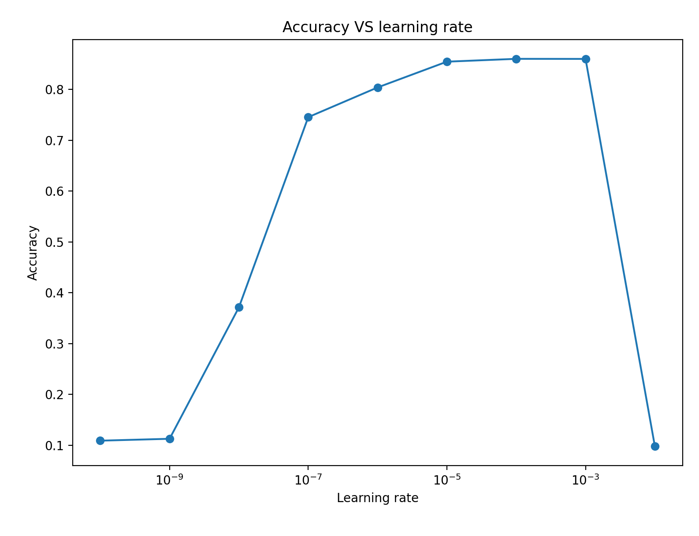

# IBI TP1 : Introduction à l'apprentissage profond

L'objectif de ce TP est d'implémenter l'algorithme du perceptron multi-couches vu en cours, de comprendre son fonctionnement et de prendre en main le framework PyTorch.

## Dataset

Nous utilisons le dataset MNIST contenant des images de taille (28*28) de chiffres manuscrits.

## Partie 1 : Perceptron

### Dimensions des tenseurs

La taille du tenseur `data_train` est de 63000 lignes (correspondant au nombre d'exemples) et 784 colonnes (correspondant à la dimension des données d'entrée). En effet, les images de taille 28*28 ont été déroulées en un vecteur de longueur 784.

Le tenseur `label_train` a une taille de 63000*10 car il y a nécéssairement autant de labels que d'exemples d'entraînement. Le 10 provient de la dimension de la sortie qui est un vecteur de taille 10, contenant la probabilité que la sortie soit égale à l'un des 10 chiffres.

La taille du tenseur `w` est de 784*10 puisque nous transformons nos données de taille 784 en une sortie égale à un vecteur de 10 classes (encodé en one-hot).

Le tenseur de biais  `b` est de taille 1*10 car il doit être de même taille que `xw` avec `x` un exemple tiré de `data_train` (matrice d'exemples d'apprentissage).

### Impact des hyperparamètres sur les performances

Nous avons fait varier `eta` de `1e-2` à `1e-10` afin d'observer l'impact sur les performances. Nous avons obtenu les courbes suivantes :

Cette figure montre bien qu'un taux d'apprentissage trop grand ne permet pas la convergence (cf `1e-2` où les mises à jour des poids sont trop grandes ce qui est assimilable à un modèle aléatoire) mais qu'un taux trop faible ne permet pas d'actualiser les poids lors de la descente de gradient (à partir de `1e-7` où nous observons une nette diminution des performances, et où pour des taux encore plus faibles, le modèle n'apprend simplement pas).

Nous avons tracé ici la performance maximale atteinte en fonction du taux d'apprentissage en échelle log. Nous constatons que la valeur optimale du taux d'aprentissage se situe dans notre cas entre `1e-5` et `1e-3`.

Lorsque nous testons le script avec les méthodes pytorch nous obtenons sans surprise les mêmes résultats.

## Partie 2 : Shallow Network

Dans cette partie, nous avons implémenté un réseau de neurones fully-connected avec une couche cachée. Nous avons implémenté ce réseau de neurones de deux façons : une en utilisant les tenseurs et en implémentant la back-propagation du gradient à la main, et une autre utilisant l'interface de haut-niveau fournie par Pytorch. La version implémentée à la main est appelée `shallow_network_barebone.py`, la version utiliant les outils de Pytorch est appelée `shallow_network_pytorch.py`.

## Partie 3 : Deep Network

## Partie 4 : Pour aller plus loin (optionnel)

## Ressources

[Fonctions PyTorch]( https://pytorch.org/docs/stable/index.html)

[Tutoriel 1]( http://pytorch.org/tutorials/beginner/pytorch_with_examples.html)

[Exemples introductifs]( http://pytorch.org/tutorials/beginner/deep_learning_ 60min_blitz.html)

